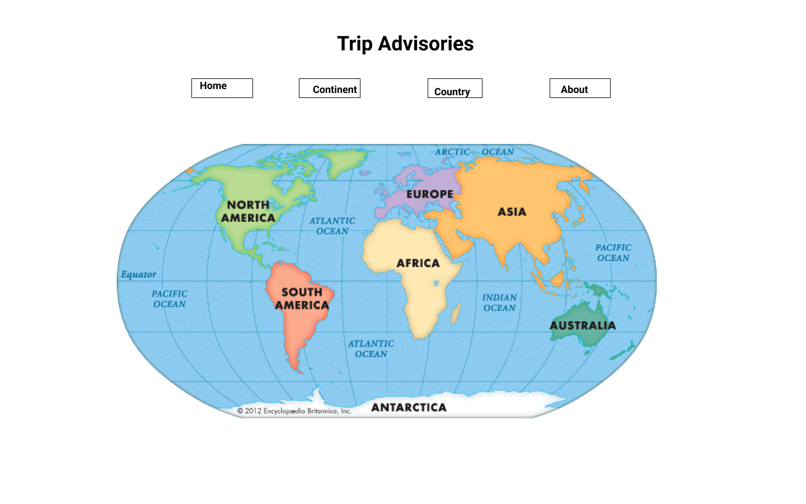
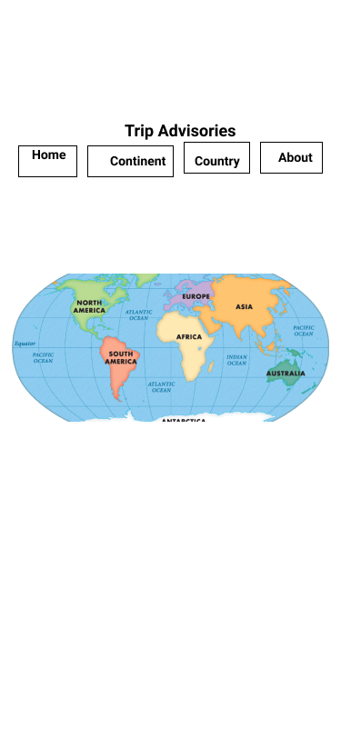
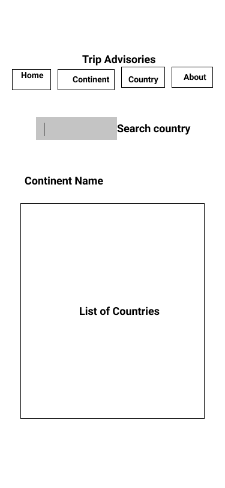
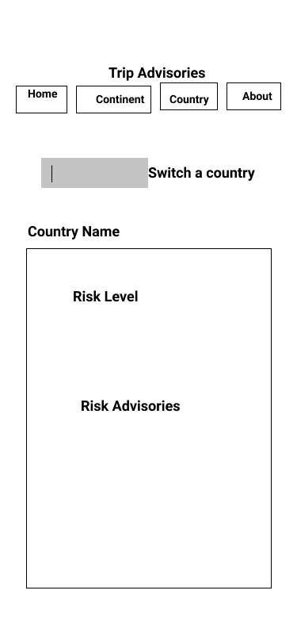

# Travel Safe Website

## Description

This website provides users up-to-date risk level and travel advisories for each country per travelers perspective, so travelers can consider if they are still comfortable going to the destination countries base on the risk level. If they still want to go, they can also use the travel advisories to prepare their trips.

### Screenshot of App

## Technologies Used

- React
- Components, props, and state
- React Router
- CSS grid and flexbox
- Style Componenets

## API link

### For Travel advisory:

MVP
https://www.travel-advisory.info/data-api
If need more information
https://developer.tugo.com/docs/read/travelsafe/v1/country

### For country images

Flags:
https://flagpedia.net/download/api
https://restcountries.eu/#sources
Maps:
https://leafletjs.com/examples/quick-start/
https://developers.google.com/maps/documentation/javascript/overview#maps_map_simple-javascript

I actually just want to find simple contour of each continent and country. I feel these map APIs are complicated.
Plan B is to find 7 continents' contour images and hard code them in React. For each country I want to find an API which can provide each country's sightseeing.
Do you have any advise?

## Visual of your component hierarchy

- App (include a navigation component, About component, and footer component)
- Home page with continents images
- Continent page with a list countries which are in that region
- Country page with all risk and travel advisories information
  

## Wire Frames

### Laptop

### Cellphone

## User Stories

### MVP Goals

- As an app user, I want to see a list of continents and each continent is clickable so that I can go to each continent page.
- As an app user, I want each country to be clickable so that I can go to each country's page with advisories information including risk level and travel advisories.
- As a developer, I want to provide a navigation bar including link to homepage, continent page, and country page, and About page.
- As an app user, I want to see a footer with date.
- As an app user, I want to see flags of each country in the continent page.

### Stretch Goals

- As an app user, I want to type country name in a search bar so that I can go directly to that country's page.
- As an app user, I want to see global map with continents in the continent page. And I want the continents images to be clickable so that I can go to a page with a list of countries in the related continents.
- As an app user, I want to see a picture of a famous place of each country in the country page.
- As an app user, I want the search bar list the countries which include what I type which means even though I don't use capitalized letter or just type part of the whole country name, it will list the relating countries.
- As an app user, I want to see more travel information like health, disease and entry exit requirement and regional/continental risk information.

## Getting Started/Installation Instructions

This project was bootstrapped with [Create React App](https://github.com/facebook/create-react-app).

### Available Scripts

In the project directory, you can run:

#### `npm start`

Runs the app in the development mode.\
Open [http://localhost:3000](http://localhost:3000) to view it in the browser.

The page will reload if you make edits.\
You will also see any lint errors in the console.

#### `npm test`

Launches the test runner in the interactive watch mode.\
See the section about [running tests](https://facebook.github.io/create-react-app/docs/running-tests) for more information.

#### `npm run build`

Builds the app for production to the `build` folder.\
It correctly bundles React in production mode and optimizes the build for the best performance.

The build is minified and the filenames include the hashes.\
Your app is ready to be deployed!

See the section about [deployment](https://facebook.github.io/create-react-app/docs/deployment) for more information.

#### `npm run eject`

**Note: this is a one-way operation. Once you `eject`, you can’t go back!**

If you aren’t satisfied with the build tool and configuration choices, you can `eject` at any time. This command will remove the single build dependency from your project.

Instead, it will copy all the configuration files and the transitive dependencies (webpack, Babel, ESLint, etc) right into your project so you have full control over them. All of the commands except `eject` will still work, but they will point to the copied scripts so you can tweak them. At this point you’re on your own.

You don’t have to ever use `eject`. The curated feature set is suitable for small and middle deployments, and you shouldn’t feel obligated to use this feature. However we understand that this tool wouldn’t be useful if you couldn’t customize it when you are ready for it.

### Learn More

You can learn more in the [Create React App documentation](https://facebook.github.io/create-react-app/docs/getting-started).

To learn React, check out the [React documentation](https://reactjs.org/).

#### Code Splitting

This section has moved here: [https://facebook.github.io/create-react-app/docs/code-splitting](https://facebook.github.io/create-react-app/docs/code-splitting)

#### Analyzing the Bundle Size

This section has moved here: [https://facebook.github.io/create-react-app/docs/analyzing-the-bundle-size](https://facebook.github.io/create-react-app/docs/analyzing-the-bundle-size)

#### Making a Progressive Web App

This section has moved here: [https://facebook.github.io/create-react-app/docs/making-a-progressive-web-app](https://facebook.github.io/create-react-app/docs/making-a-progressive-web-app)

#### Advanced Configuration

This section has moved here: [https://facebook.github.io/create-react-app/docs/advanced-configuration](https://facebook.github.io/create-react-app/docs/advanced-configuration)

#### Deployment

This section has moved here: [https://facebook.github.io/create-react-app/docs/deployment](https://facebook.github.io/create-react-app/docs/deployment)

#### `npm run build` fails to minify

This section has moved here: [https://facebook.github.io/create-react-app/docs/troubleshooting#npm-run-build-fails-to-minify](https://facebook.github.io/create-react-app/docs/troubleshooting#npm-run-build-fails-to-minify)

## Contribution Guidelines

You can fork and clone the repository from GitHub. Check out to a new branch and submite a pull request. I would love to see your advice for improvement.
