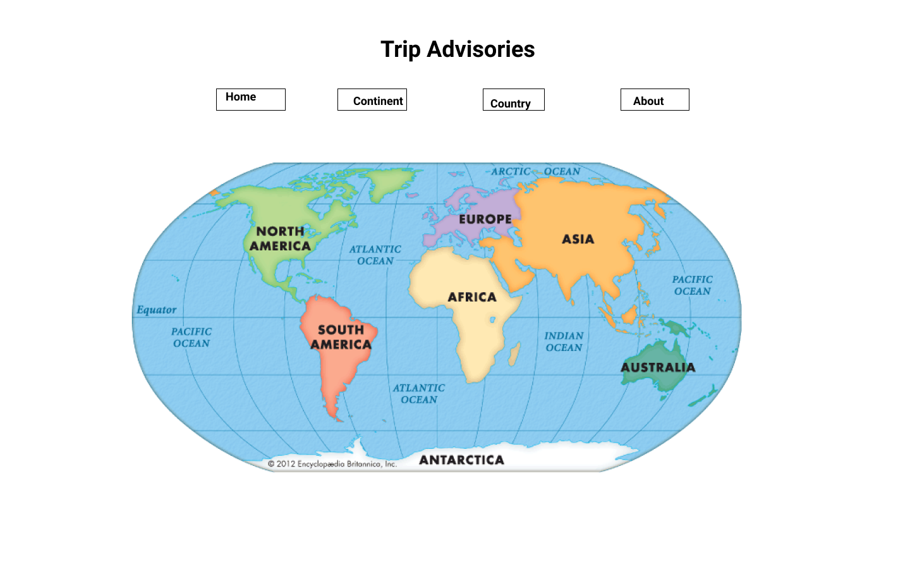
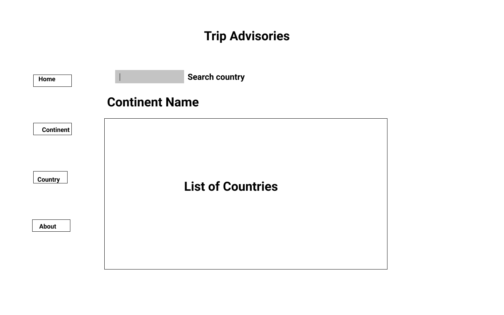
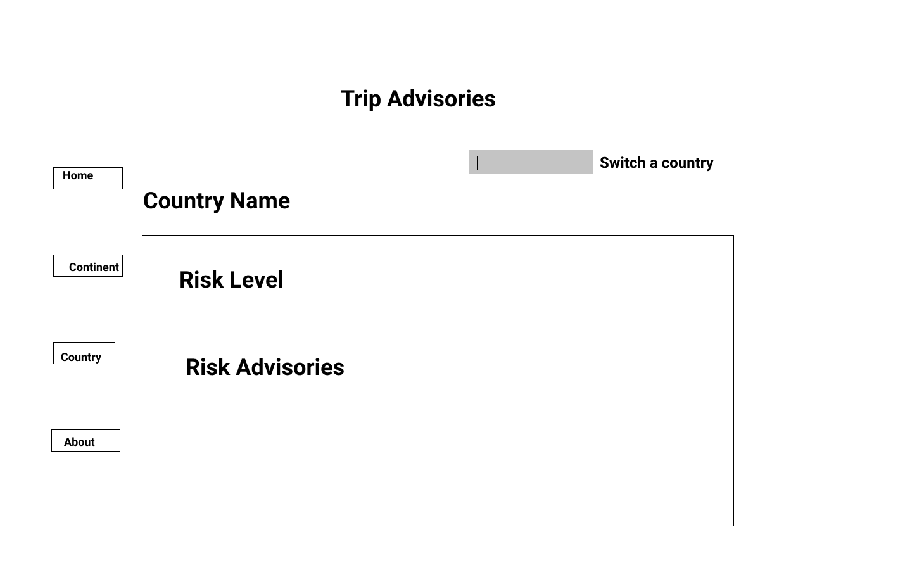
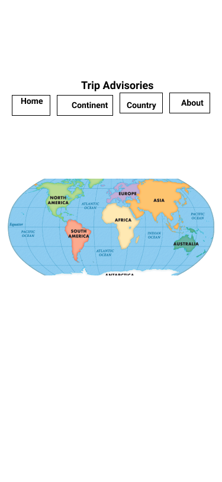
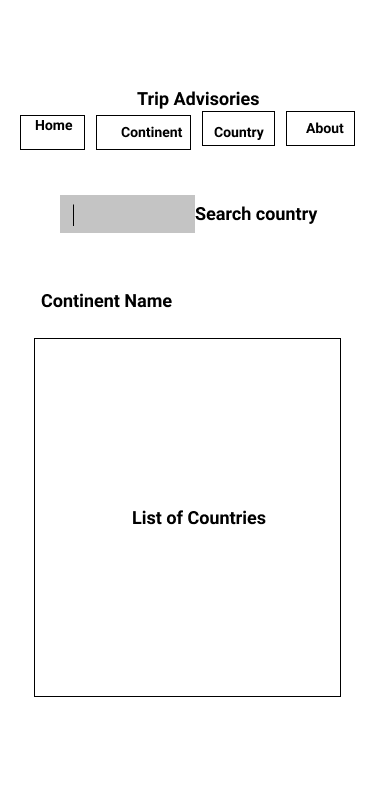
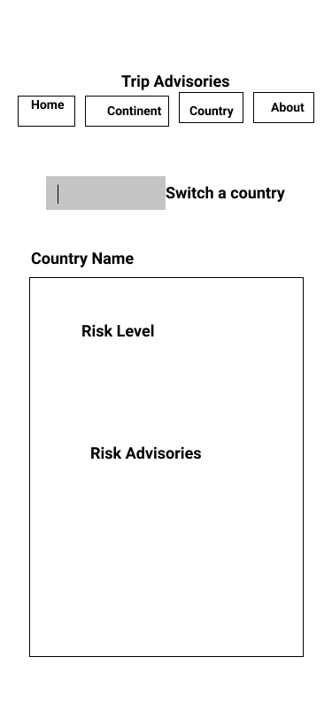

# Travel Safe Website

## Description

This website provides users up-to-date risk level and travel advisories for each country per travelers perspective, so travelers can consider if they are still comfortable going to the distinate countries base on the risk level. If they still want to go, they can also use the travel advisories to prepare their trips.

## Technologies Used

- React
- Components, props, and state
- React Router

## API link

### For Travel advisory:

MVP
https://www.travel-advisory.info/data-api
If need more information
https://developer.tugo.com/docs/read/travelsafe/v1/country

### For country images

Flags:
https://flagpedia.net/download/api
https://restcountries.eu/#sources
Maps:
https://leafletjs.com/examples/quick-start/
https://developers.google.com/maps/documentation/javascript/overview#maps_map_simple-javascript

I actually just want to find simple contour of each continent and country. I feel these map APIs are complicated.
Plan B is to find 7 continents' contour images and hard code them in React. For each country I want to find an API which can provide each country's sightseeing.
Do you have any advise?

## Visual of your component hierarchy

- App (include a navigation component, About component, and footer component)
- Home page with continents images
- Continent page with a list countries which are in that region
- Country page with all risk and travel advisories information

## Wire Frames

### Laptop

### Cellphone

## User Stories

### MVP Goals

- As an app user, I want to see a list of continents and each continent is clickable so that I can go to each continent page.
- As an app user, I want each country to be clickable so that I can go to each country's page with advisories information including risk level and travel advisories.
- As a developer, I want to provide a navigation bar including link to homepage, continent page, and country page, and About page.
- As an app user, I want to see a footer with date on it.
- As an app user, I want to see flags of each country in the continent page.

### Stretch Goals

- As an app user, I want to see global map with continents in the home page. And I want the continents images to be clickable so that I can go to a page with a list of countries in the related continents.
- As an app user, I want to type country name in a search bar so that I can go directly to that country's page.
- As an app user, I want to see more travel information like health, disease and entry exit requirement.
- As an app user, I want to see a picture of a famous place of each country in the country page.
- As an app user, I want to see regional/continental risk information.
- As an app user, I want to see a list of most frequent check country.
